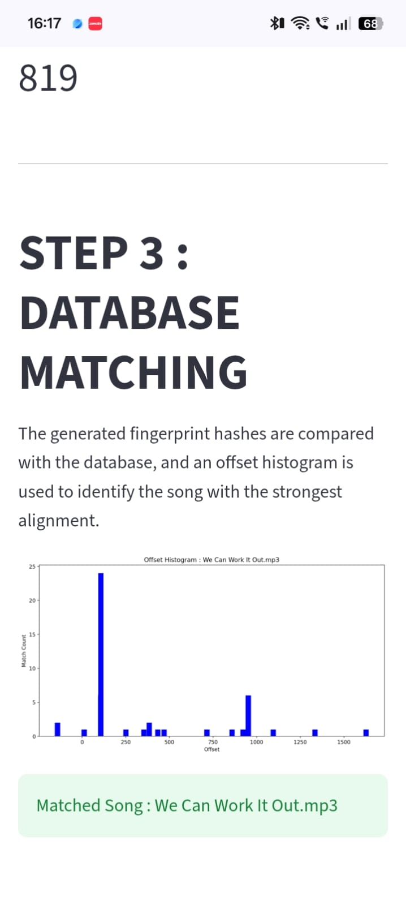

# Audio-Fingerprinting

## Description
This project implements a basic song recognition system inspired by Shazam. 
It accepts individual or batch audio clips as queries and identifies the corresponding song using spectrogram analysis and audio fingerprint matching. 
## Features

- 🎵 Recognizes songs from short audio clips.
- 📂 Supports both single and batch query identification.
- 🖥️ Interactive graphical user interface for easy operation.
- 📊 Displays intermediate processing results, including spectrograms, constellation maps, and offset histograms.
- ⚡ Fast song matching using hash-based audio fingerprints.
- 💾 Pre-computed fingerprint database for efficient retrieval.
- 🔍 Visualizes the complete recognition pipeline.

## Screenshots
<h3>App Interface</h3>

  

## Intermediatary steps in identification
<h3>Spectrogram</h3>

  

<h3>Constellation map</h3>

  

<h3>Offset Histogram</h3>

  

## Workflow
The audio fingerprinting system follows the workflow shown below:
1. **Load Audio Database**
   - Load all songs from the database directory.
     
2. **Generate Spectrograms**
   - Convert each audio signal into a spectrogram to obtain its time-frequency representation.
     
3. **Extract Spectral Peaks**
   - Detect prominent local maxima in the spectrogram that are robust to noise and distortions.
     
4. **Create Constellation Maps**
   - Represent the detected spectral peaks as constellation maps for efficient feature extraction.
     
5. **Generate Audio Fingerprints**
   - Form hash-based fingerprints using pairs of spectral peaks and their corresponding time differences.
    
6. **Build Fingerprint Database**
   - Store the generated fingerprints of all songs in a serialized database for fast retrieval.

7. **Process Query Audio**
   - Load the query audio clip and repeat the same preprocessing, spectrogram generation, peak detection, and fingerprint generation steps.

8. **Fingerprint Matching**
   - Compare the fingerprints of the query clip with those stored in the database to identify matching hashes.

9. **Offset Histogram Analysis**
   - Compute the histogram of matching time offsets to determine the best alignment between the query and candidate songs.

10. **Display Recognition Results**
    - Display the identified song along with intermediate visualizations such as the spectrogram, constellation map, and offset histogram.

