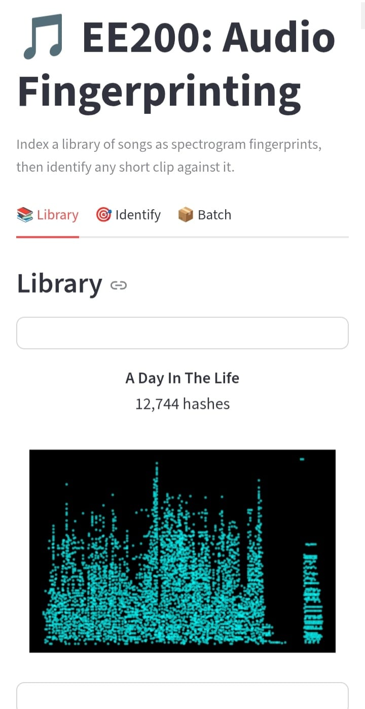
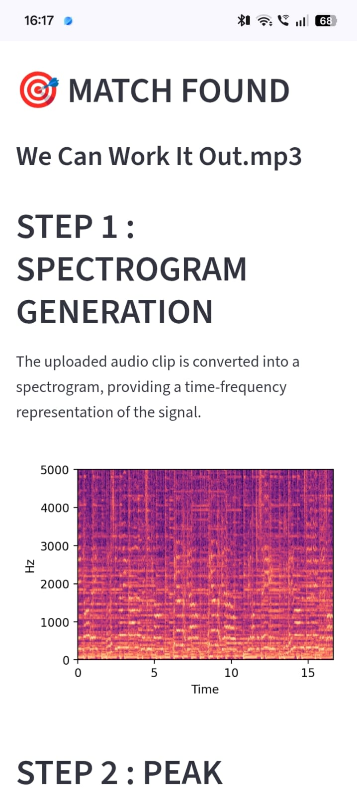
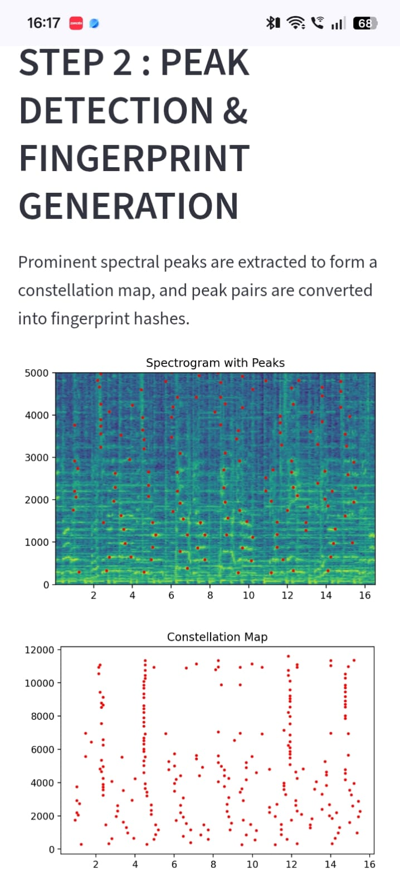

# Audio-Fingerprinting

## Description
This project implements a basic song recognition system inspired by Shazam. 
It accepts individual or batch audio clips as queries and identifies the corresponding song using spectrogram analysis and audio fingerprint matching. 
## Features

🎵 **Generates Spectrograms**  
Computes the spectrogram of each audio clip to represent its frequency content over time.

⭐ **Creates Constellation Maps**  
Detects prominent spectral peaks and generates constellation maps for fingerprint creation.

🔑 **Generates Audio Fingerprints**  
Creates compact hash-based fingerprints using peak pairs and their time differences.

🗄️ **Builds Fingerprint Database**  
Indexes fingerprints of all songs for efficient storage and fast retrieval.

🔍 **Identifies Songs from Query Clips**  
Recognizes songs from individual or batch query clips by matching fingerprints.

📊 **Offset Histogram Analysis**  
Determines the best alignment between query and database fingerprints to identify the correct song.

🖼️ **Displays Intermediate Results**  
Visualizes the spectrogram, constellation map, and offset histogram for every query.

📂 **Batch Query Support**  
Processes multiple query clips in a single run and returns a csv file containing the results of prediction.

Uses compact hash tables to achieve quick and scalable song identification.
## Screenshots
<h3>App Interface</h3>

  

### Song identification page

<h3>Song Identification</h3>

  

## Intermediatary steps in identification
### Spectrogram
<h3>Spectrogram</h3>

  

### Constellation Map
<h3>Constellation map</h3>

  

### Offset Histogram

<h3>Offset Histogram</h3>

  

